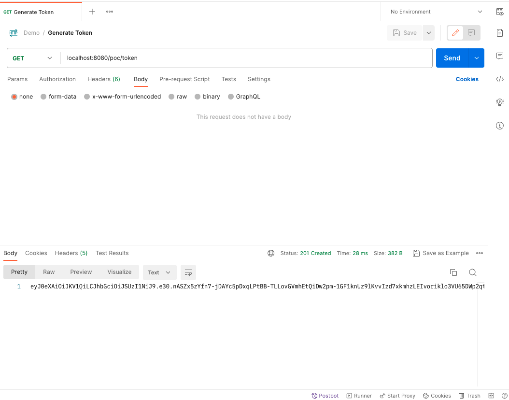
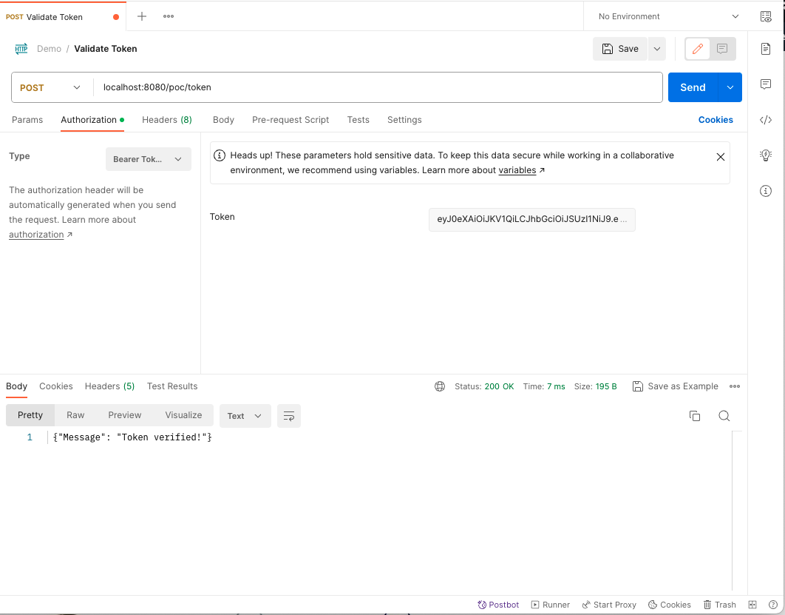
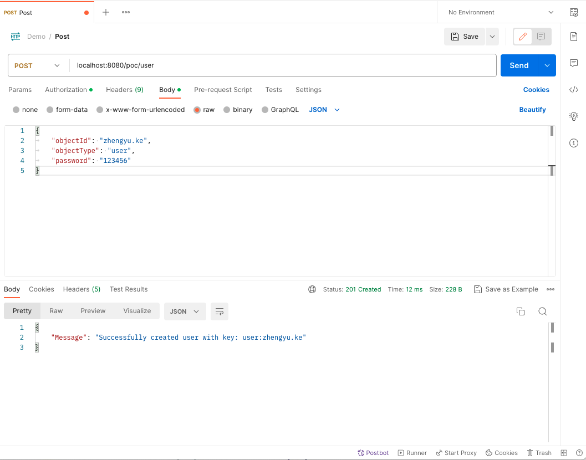
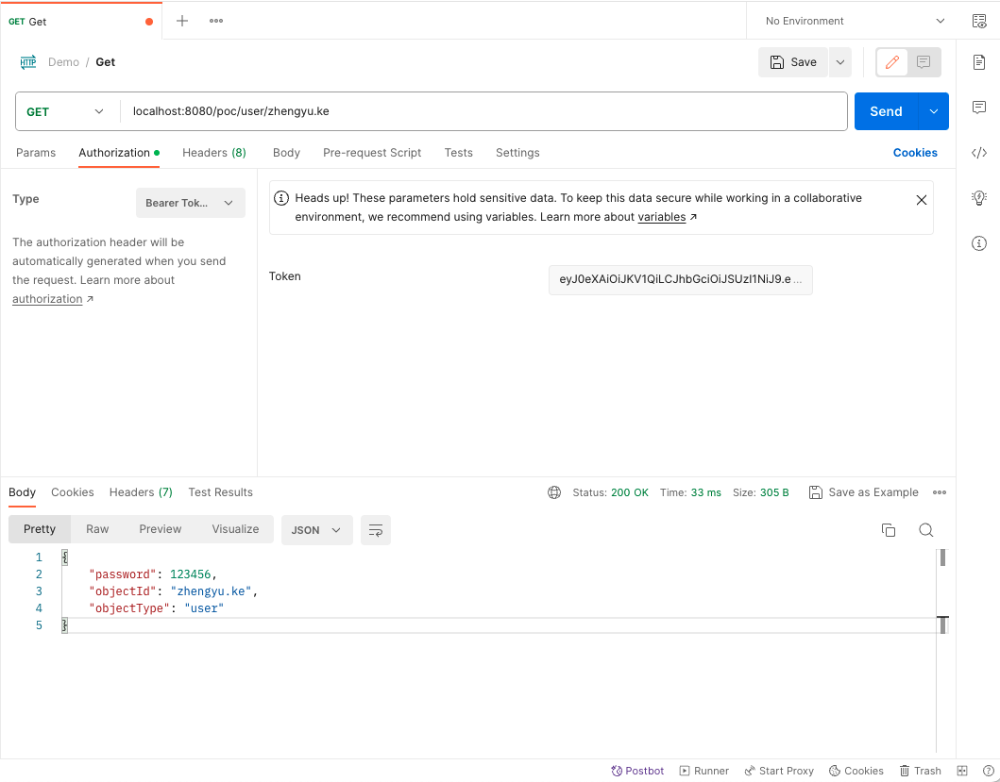
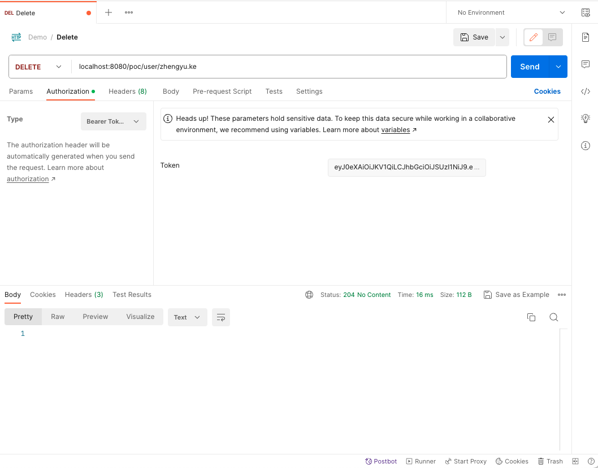
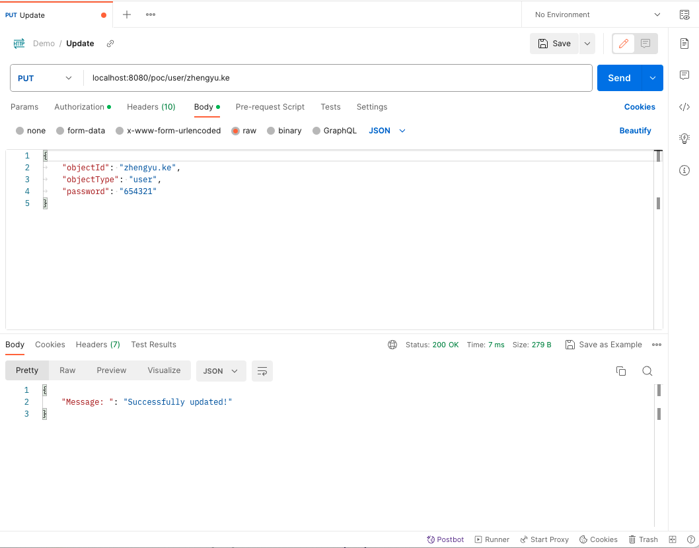

# Proof-of-Concept
The application functions as a user management system. It allows users to upload documents in JSON format and undergo a thorough verification process. Once verified, users gain access to a comprehensive set of CRUD (Create, Read, Update, Delete) operations through HTTP methods such as POST, PUT, DELETE, and PATCH. The application utilizes Etag to efficiently track and confirm data updates. All of this valuable data is securely stored and managed within Redis. 
## Tech Stack

- Spring Boot (Java)
- Redis
- Maven

## Features

- Authentication using Token generated by JWT
- Validate request JSON object with JSON Schema
- Cache Server Response and validate cache using ETag
- Support POST, PUT, PATCH, GET and DELETE Http Methods for the REST API
- Store JSON Objects in Redis key-value store for data persistence

## API Endpoints
- GET `/token` - Generates a JWT token used to authenticate future requests.
- POST `/token` - Verifies the token.
- POST `/user` - Creates a new user provided in the request body
- GET `/{objectType}/{objectId}` - Fetches an existing plan provided by the type and id
    - An Etag for the object can be provided in the `If-None-Match` HTTP Request Header
    - If the request is successful, a valid Etag for the object is returned in the `ETag` HTTP Response Header
- DELETE `/{objectType}/{objectId}` - Deletes an existing plan provided by the type and id
    - A valid Etag for the object should also be provided in the `If-Match` HTTP Request Header
- PUT `/{objectType}/{objectId}` - Updates an existing plan provided by the type and id
    - A valid Etag for the object should also be provided in the `If-Match` HTTP Request Header
- PATCH `/{objectType}/{objectId}` - Patches an existing plan provided by the type and id
    - A valid Etag for the object should also be provided in the `If-Match` HTTP Request Header

## Tests  

